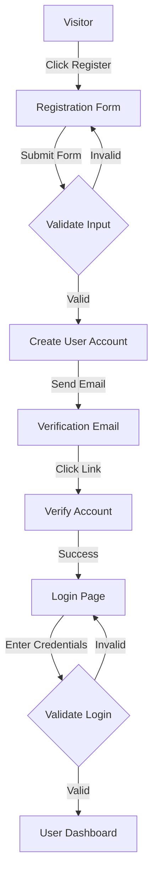
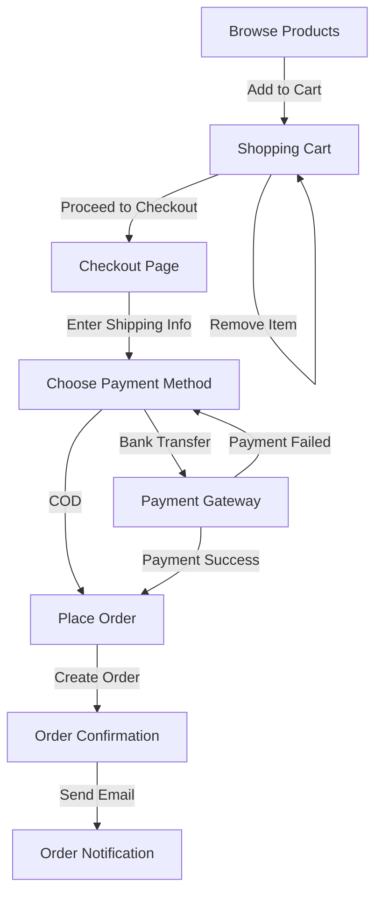
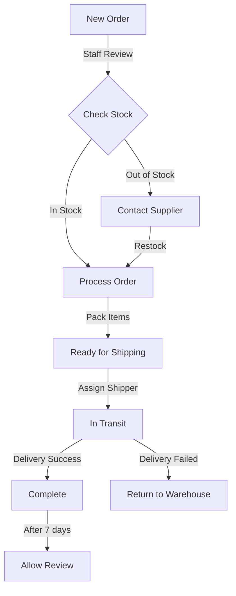
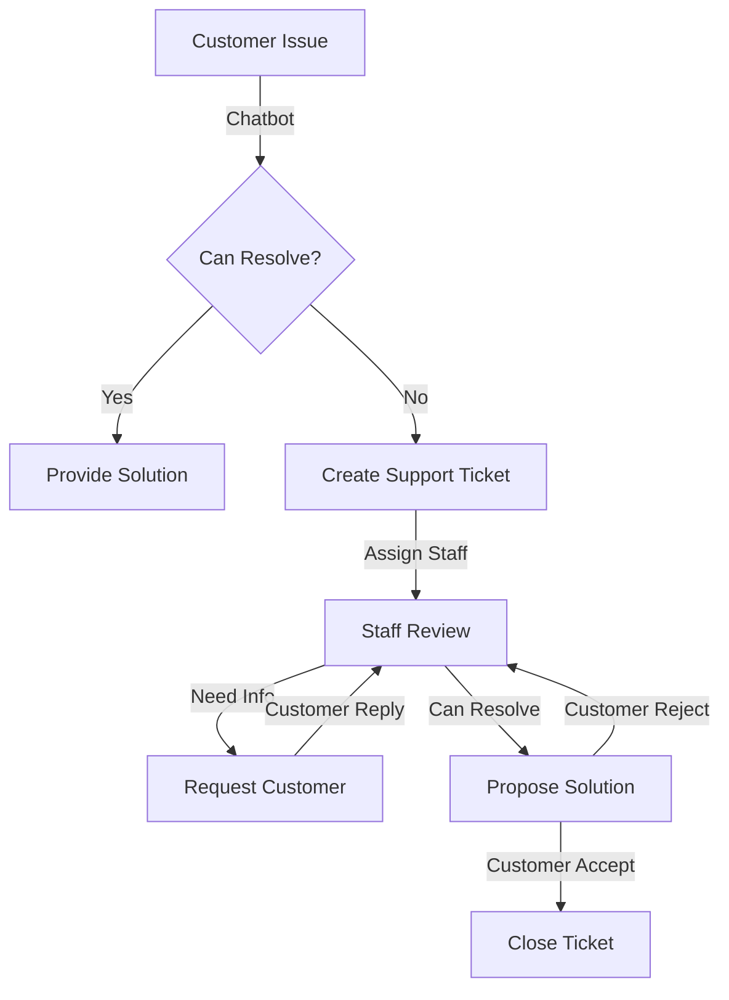
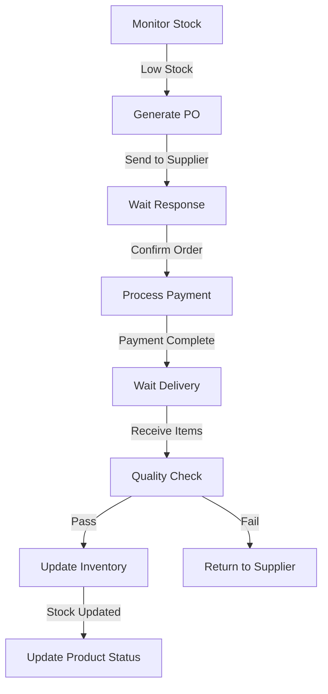
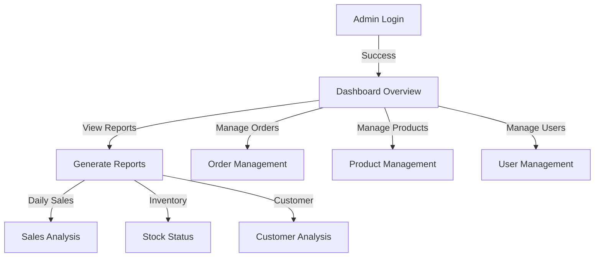
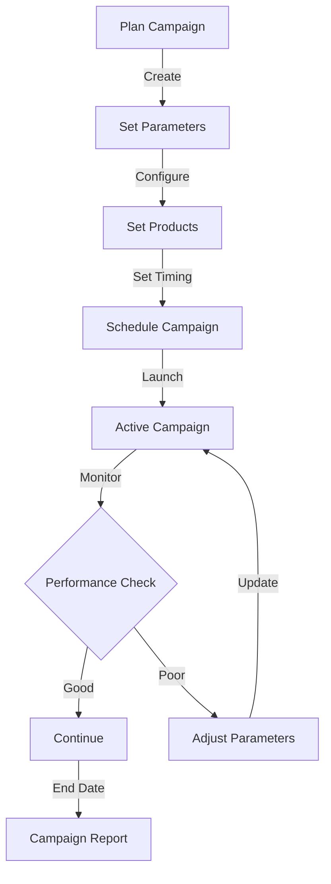
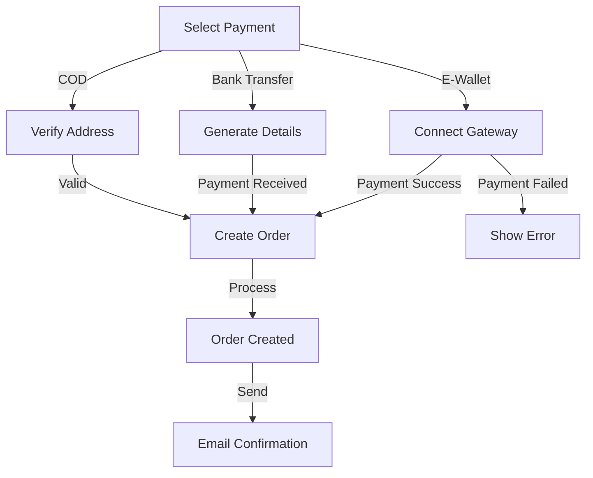

# 📋 **DACK_WEB_NHOM1 (ElectroMart - Website bán hàng điện tử)**

## 🎯 **Tổng quan dự án**

Dự án **ELECTROMART** - Website bán hàng điện tử trực tuyến được xây dựng bằng **Java Servlet/JSP** với kiến trúc MVC.

## **🏗️Công nghệ sử dụng:**
- **Framework:** Java Servlet/JSP (Jakarta EE 10)
- **ORM**: JPA (Jakarta Persistence) với EclipseLink 4.0.2
- **Database**: PostgreSQL (deployed trên Render)
- **Build Tool**: Maven
- **Java Version**: 11
- **Server**: Jakarta Servlet 6.0
- **UI Reference**: [phongvu.vn](https://phongvu.vn/)

---

## 📁 **Cấu trúc thư mục chính**


---

## 🎯 **CHỨC NĂNG CHÍNH CỦA HỆ THỐNG**
### **1. QUẢN LÝ NGƯỜI DÙNG**
+	Đăng ký/Đăng nhập khách hàng
+	Quên mật khẩu (gửi email reset)
+	Phân quyền: Admin, Nhân viên, Khách hàng
+	Hệ thống hạng thành viên (BẠC, VÀNG, KIM CƯƠNG)
+	Quản lý thông tin cá nhân
+	Quản lý địa chỉ giao hàng
+	Xem lịch sử mua hàng

### **2. QUẢN LÝ SẢN PHẨM**
+	Hiển thị danh sách sản phẩm (Laptop, PC, Phụ kiện, Màn hình)
+	Tìm kiếm và lọc sản phẩm theo loại, thương hiệu
+	Chi tiết sản phẩm với thông số kỹ thuật đầy đủ
+	Autocomplete khi tìm kiếm
+	So sánh sản phẩm
+	Đánh giá và bình luận sản phẩm
+	Sản phẩm đề xuất
+	Danh sách yêu thích

### **3. GIỎ HÀNG & THANH TOÁN**
+	Thêm/xóa/cập nhật giỏ hàng (lưu trong Session)
+	Checkout và tạo đơn hàng
+	Nhiều phương thức thanh toán
    - Thanh toán khi nhận hàng (COD)
    - Chuyển khoản ngân hàng
    - Ví điện tử
+	Áp dụng phiếu giảm giá
+	Tính phí vận chuyển theo địa chỉ
+	Chọn thời gian giao hàng

### **4. QUẢN LÝ ĐƠN HÀNG**
+	Xem lịch sử đơn hàng
+	Theo dõi trạng thái đơn (MỚI, ĐANG XỬ LÝ, ĐANG GIAO, HOÀN TẤT, HỦY, TRẢ HÀNG, ĐÃ THANH TOÁN)
+	Xác nhận nhận hàng
+	Yêu cầu hủy đơn
+	Yêu cầu trả hàng/hoàn tiền
+	In hóa đơn
+	Đánh giá sản phẩm sau khi nhận hàng

### **5. CHƯƠNG TRÌNH KHUYẾN MÃI**
+	Quản lý mã giảm giá
+	Flash sale theo thời gian
+	Combo giảm giá
+	Ưu đãi theo hạng thành viên
+	Tích điểm đổi quà
+	Quà tặng sinh nhật

### **6. HỖ TRỢ KHÁCH HÀNG**
+	Chatbot tự động
+	Live chat với nhân viên
+	Hệ thống ticket hỗ trợ
+	FAQ - Câu hỏi thường gặp
+	Chính sách bảo hành
+	Hướng dẫn mua hàng/thanh toán

### **7. ADMIN PANEL**
+	Dashboard (thống kê tổng quan)
+	Quản lý sản phẩm (CRUD)
    - Quản lý danh mục
    - Quản lý thương hiệu
    - Quản lý thuộc tính sản phẩm
    - Quản lý kho (nhập/xuất/tồn)
+	Quản lý đơn hàng
    - Xử lý đơn hàng mới
    - Quản lý vận chuyển
    - Xử lý đơn hủy/trả hàng
+	Quản lý khách hàng
    - Phân hạng khách hàng
    - Quản lý điểm thưởng
    - Xử lý khiếu nại
+	Quản lý khuyến mãi
    - Tạo mã giảm giá
    - Thiết lập flash sale
    - Quản lý combo
+	Báo cáo doanh thu
    - Thống kê theo thời gian
    - Thống kê theo danh mục
    - Thống kê theo khu vực
    - Báo cáo lợi nhuận

---

## 📦 **CHI TIẾT CÁC PACKAGE**

## **1. CONTROLLER PACKAGE (com.demo.controller)**
Xử lý các request từ client và điều hướng tới các service tương ứng.

### **Chức năng người dùng:**

- AuthController: Xử lý đăng nhập, đăng ký, quên mật khẩu
- UserController: Quản lý thông tin người dùng
- ProfileController: Cập nhật hồ sơ, địa chỉ

### **Chức năng mua hàng:**

- ProductController: Hiển thị và tìm kiếm sản phẩm
- CartController: Quản lý giỏ hàng
- CheckoutController: Xử lý đặt hàng
- PaymentController: Xử lý thanh toán

### **Admin Panel:**

- AdminController: Dashboard và thống kê
- ProductManagementController: Quản lý sản phẩm
- OrderManagementController: Quản lý đơn hàng
- UserManagementController: Quản lý người dùng

## **2. SERVICE PACKAGE (com.demo.service)**
Chứa business logic của ứng dụng.

### **Core Services:**
- UserService: Xử lý logic người dùng
- ProductService: Xử lý logic sản phẩm
- OrderService: Xử lý logic đơn hàng
- CartService: Xử lý logic giỏ hàng
- PaymentService: Xử lý logic thanh toán

### **Support Services:**
- EmailService: Gửi email
- FileService: Xử lý file
- ValidationService: Kiểm tra dữ liệu
- CacheService: Quản lý cache
- LogService: Ghi log

### **Admin Services:**
- ReportService: Tạo báo cáo
- StatisticsService: Thống kê
- InventoryService: Quản lý kho

## **3. MODEL PACKAGE (com.demo.model)**
Chứa các entity và model của ứng dụng.

### **Entity chính:**

- User: Thông tin người dùng
- Product: Thông tin sản phẩm
- Category: Danh mục sản phẩm
- Brand: Thương hiệu

### **Order (Đơn hàng):**

- Order: Thông tin đơn hàng
- OrderItem: Chi tiết đơn hàng
- OrderStatus: Trạng thái đơn hàng

### **Cart (Giỏ hàng):**

- Cart: Thông tin giỏ hàng
- CartItem: Sản phẩm trong giỏ

### **Warehouse (Kho):**

- Inventory: Tồn kho
- InventoryHistory: Lịch sử nhập xuất
- Supplier: Nhà cung cấp

### **Customer Support:**

- Ticket: Phiếu hỗ trợ
- ChatMessage: Tin nhắn chat
- FAQ: Câu hỏi thường gặp

### **Helper Models:**

- DTO: Data Transfer Objects
- ViewModels: Models cho view
- Requests/Responses: Models cho API

## **4. PERSISTENCE PACKAGE (com.demo.persistence)**
Xử lý tương tác với database.

**Pattern: Generic DAO với JPA**


**Tính năng GenericDAO:**
+	CRUD: find(), findAll(), save(), update(), delete()
+	Pagination: findAll(page, size, orderBy, asc)
+	Dynamic query: findWhere(whereClause, params)
+	Transaction: inTransaction(), inTransactionVoid()
+	Count: count()

### **Repository Classes:**
- UserRepository
- ProductRepository
- OrderRepository
- CartRepository
- InventoryRepository

## **5. UTIL PACKAGE (com.demo.util)**
Chứa các utility class và helper functions.

### **Helper Classes:**
- SecurityUtil: Mã hóa và bảo mật
- DateUtil: Xử lý ngày tháng
- StringUtil: Xử lý chuỗi
- ValidationUtil: Kiểm tra dữ liệu
- FileUtil: Xử lý file

### **Constants:**
- AppConstants: Hằng số ứng dụng
- SecurityConstants: Hằng số bảo mật
- MessageConstants: Thông điệp

## **6. FILTER PACKAGE (com.electromart.filter)**
Xử lý request/response trước khi đến controller.

### **Security Filters:**
- AuthenticationFilter: Xác thực người dùng
- AuthorizationFilter: Phân quyền
- JWTFilter: Xử lý JWT

### **Other Filters:**
- LoggingFilter: Ghi log
- CORSFilter: Xử lý CORS
- EncodingFilter: Xử lý encoding

## **7. ENUMS PACKAGE (com.demo.enums)**
Chứa các enum của hệ thống.


### **Main Enums:**
- UserRole: ADMIN, STAFF, CUSTOMER
- OrderStatus: NEW, PROCESSING, SHIPPING, COMPLETED, etc.
- PaymentMethod: COD, BANK_TRANSFER, E_WALLET
- MembershipTier: SILVER, GOLD, DIAMOND

## 🎨 **VIEW STRUCTURE (JSP Files)**

### **1. Layout Templates**
```
webapp/WEB-INF/views/
├── layout_header.jspf          # Header chung cho user
├── layout_footer.jspf          # Footer chung cho user
├── layout_admin_header.jspf    # Header cho admin panel
└── layout_admin_footer.jspf    # Footer cho admin panel
```

### **2. User Interface Pages**
```
webapp/WEB-INF/views/
├── home.jsp              # Trang chủ
├── login.jsp            # Đăng nhập
├── register.jsp         # Đăng ký
├── forgot-password.jsp  # Quên mật khẩu
├── reset-password.jsp   # Đặt lại mật khẩu
├── profile.jsp          # Trang cá nhân
└── search.jsp           # Trang kết quả tìm kiếm
```

### **3. Product Related Pages**
```
webapp/WEB-INF/views/
├── product_detail.jsp   # Chi tiết sản phẩm
├── category.jsp         # Danh sách theo danh mục
├── compare.jsp          # So sánh sản phẩm
└── promotions.jsp       # Trang khuyến mãi
```

### **4. Shopping Related Pages**
```
webapp/WEB-INF/views/
├── cart.jsp             # Giỏ hàng
├── checkout.jsp         # Thanh toán
├── payment_result.jsp   # Kết quả thanh toán
├── orders.jsp           # Danh sách đơn hàng
└── order_detail.jsp     # Chi tiết đơn hàng
```

### **5. Support Pages**
```
webapp/WEB-INF/views/
├── chatbot.jsp          # Chatbot hỗ trợ
├── faq.jsp              # Câu hỏi thường gặp
└── contact.jsp          # Liên hệ
```

### **6. Admin Panel Pages**
```
webapp/WEB-INF/views/admin/
├── dashboard.jsp            # Trang tổng quan
├── products/
│   ├── list.jsp            # Danh sách sản phẩm
│   ├── add.jsp             # Thêm sản phẩm
│   └── edit.jsp            # Sửa sản phẩm
├── orders/
│   ├── list.jsp            # Danh sách đơn hàng
│   └── detail.jsp          # Chi tiết đơn hàng
├── users/
│   ├── list.jsp            # Danh sách người dùng
│   └── edit.jsp            # Sửa thông tin người dùng
├── promotions/
│   ├── list.jsp            # Danh sách khuyến mãi
│   └── edit.jsp            # Quản lý khuyến mãi
└── reports/
    ├── sales.jsp           # Báo cáo doanh số
    ├── inventory.jsp       # Báo cáo kho
    └── customers.jsp       # Báo cáo khách hàng
```

### **7. Partial Views**
```
webapp/WEB-INF/views/partials/
├── product_card.jsp        # Card hiển thị sản phẩm
├── pagination.jsp          # Phân trang
├── breadcrumb.jsp          # Breadcrumb navigation
├── filter_sidebar.jsp      # Sidebar lọc sản phẩm
└── notification.jsp        # Thông báo
```

### **8. Error Pages**
```
webapp/WEB-INF/views/errors/
├── 404.jsp                # Trang không tồn tại
├── 403.jsp                # Không có quyền truy cập
├── 500.jsp                # Lỗi server
└── maintenance.jsp        # Bảo trì
```

### **9. Email Templates**
```
webapp/WEB-INF/views/emails/
├── welcome.jsp            # Email chào mừng
├── order_confirmation.jsp # Xác nhận đơn hàng
├── shipping_update.jsp    # Cập nhật vận chuyển
├── reset_password.jsp     # Đặt lại mật khẩu
└── newsletter.jsp         # Template newsletter
```

### **10. Asset Structure**
```
webapp/assets/
├── css/
│   ├── site.css          # CSS chung
│   ├── admin.css         # CSS cho admin panel
│   └── responsive.css    # CSS responsive
├── js/
│   ├── site.js           # JavaScript chung
│   ├── cart.js           # Logic giỏ hàng
│   ├── validation.js     # Validate form
│   └── admin.js          # JS cho admin panel
└── img/
    ├── logo/             # Logo website
    ├── banners/          # Ảnh banner
    ├── products/         # Ảnh sản phẩm
    └── icons/            # Icon và svg
```

## 💾 **DATABASE CONFIGURATION**

### **1. Database Information**
```properties
Database Type: PostgreSQL
Version: 14.0 or higher
Character Set: UTF-8
Collation: en_US.UTF-8
```

### **2. JPA Configuration (persistence.xml)**
```xml
<persistence-unit name="ElectroMartPU" transaction-type="RESOURCE_LOCAL">
    <provider>org.eclipse.persistence.jpa.PersistenceProvider</provider>
    
    <!-- Entity Classes -->
    <class>com.demo.model.User</class>
    <class>com.demo.model.Product</class>
    <class>com.demo.model.Order</class>
    <!-- Other entity classes... -->

    <properties>
        <!-- Database Connection -->
        <property name="jakarta.persistence.jdbc.url" 
                  value="jdbc:postgresql://[host]:[port]/electromart_db"/>
        <property name="jakarta.persistence.jdbc.user" value="your_username"/>
        <property name="jakarta.persistence.jdbc.password" value="your_password"/>
        <property name="jakarta.persistence.jdbc.driver" 
                  value="org.postgresql.Driver"/>

        <!-- EclipseLink Properties -->
        <property name="eclipselink.logging.level" value="FINE"/>
        <property name="eclipselink.logging.parameters" value="true"/>
        <property name="eclipselink.cache.shared.default" value="false"/>
        <property name="eclipselink.weaving" value="static"/>
    </properties>
</persistence-unit>
```

### **3. Database Schema**

#### **Core Tables**
```sql
-- Users & Authentication
CREATE TABLE users (
    id SERIAL PRIMARY KEY,
    username VARCHAR(50) UNIQUE NOT NULL,
    email VARCHAR(100) UNIQUE NOT NULL,
    password_hash VARCHAR(255) NOT NULL,
    role VARCHAR(20) NOT NULL,
    status VARCHAR(20) NOT NULL,
    created_at TIMESTAMP DEFAULT CURRENT_TIMESTAMP
);

-- Products
CREATE TABLE products (
    id SERIAL PRIMARY KEY,
    name VARCHAR(200) NOT NULL,
    sku VARCHAR(50) UNIQUE NOT NULL,
    description TEXT,
    price DECIMAL(15,2) NOT NULL,
    category_id INT REFERENCES categories(id),
    brand_id INT REFERENCES brands(id),
    stock_quantity INT DEFAULT 0,
    status VARCHAR(20) DEFAULT 'ACTIVE'
);

-- Categories
CREATE TABLE categories (
    id SERIAL PRIMARY KEY,
    name VARCHAR(100) NOT NULL,
    parent_id INT REFERENCES categories(id),
    slug VARCHAR(100) UNIQUE NOT NULL,
    description TEXT
);
```

#### **Order Management**
```sql
-- Orders
CREATE TABLE orders (
    id SERIAL PRIMARY KEY,
    user_id INT REFERENCES users(id),
    total_amount DECIMAL(15,2) NOT NULL,
    status VARCHAR(20) NOT NULL,
    payment_method VARCHAR(50),
    shipping_address_id INT REFERENCES addresses(id),
    created_at TIMESTAMP DEFAULT CURRENT_TIMESTAMP
);

-- Order Items
CREATE TABLE order_items (
    id SERIAL PRIMARY KEY,
    order_id INT REFERENCES orders(id),
    product_id INT REFERENCES products(id),
    quantity INT NOT NULL,
    price_at_time DECIMAL(15,2) NOT NULL,
    UNIQUE(order_id, product_id)
);
```

#### **Customer Management**
```sql
-- Customer Profiles
CREATE TABLE customer_profiles (
    id SERIAL PRIMARY KEY,
    user_id INT REFERENCES users(id),
    first_name VARCHAR(50),
    last_name VARCHAR(50),
    phone VARCHAR(20),
    membership_tier VARCHAR(20),
    points INT DEFAULT 0
);

-- Addresses
CREATE TABLE addresses (
    id SERIAL PRIMARY KEY,
    user_id INT REFERENCES users(id),
    address_line1 VARCHAR(255) NOT NULL,
    address_line2 VARCHAR(255),
    city VARCHAR(100) NOT NULL,
    state VARCHAR(100) NOT NULL,
    postal_code VARCHAR(20),
    is_default BOOLEAN DEFAULT false
);
```

#### **Inventory Management**
```sql
-- Inventory Transactions
CREATE TABLE inventory_transactions (
    id SERIAL PRIMARY KEY,
    product_id INT REFERENCES products(id),
    quantity INT NOT NULL,
    type VARCHAR(20) NOT NULL, -- IN/OUT
    reference_type VARCHAR(50), -- ORDER/RESTOCK
    reference_id INT,
    created_at TIMESTAMP DEFAULT CURRENT_TIMESTAMP
);

-- Suppliers
CREATE TABLE suppliers (
    id SERIAL PRIMARY KEY,
    name VARCHAR(200) NOT NULL,
    contact_person VARCHAR(100),
    email VARCHAR(100),
    phone VARCHAR(20),
    address TEXT
);
```

#### **Promotion & Marketing**
```sql
-- Promotions
CREATE TABLE promotions (
    id SERIAL PRIMARY KEY,
    code VARCHAR(50) UNIQUE NOT NULL,
    type VARCHAR(20) NOT NULL,
    discount_value DECIMAL(15,2) NOT NULL,
    minimum_purchase DECIMAL(15,2),
    start_date TIMESTAMP NOT NULL,
    end_date TIMESTAMP NOT NULL,
    usage_limit INT,
    used_count INT DEFAULT 0
);

-- Product Reviews
CREATE TABLE product_reviews (
    id SERIAL PRIMARY KEY,
    product_id INT REFERENCES products(id),
    user_id INT REFERENCES users(id),
    rating INT NOT NULL CHECK (rating BETWEEN 1 AND 5),
    comment TEXT,
    created_at TIMESTAMP DEFAULT CURRENT_TIMESTAMP
);
```

### **4. Database Indexes**
```sql
-- Performance Indexes
CREATE INDEX idx_products_category ON products(category_id);
CREATE INDEX idx_products_brand ON products(brand_id);
CREATE INDEX idx_orders_user ON orders(user_id);
CREATE INDEX idx_orders_status ON orders(status);
CREATE INDEX idx_order_items_order ON order_items(order_id);
CREATE INDEX idx_order_items_product ON order_items(product_id);
CREATE INDEX idx_inventory_product ON inventory_transactions(product_id);
CREATE INDEX idx_promotions_code ON promotions(code);
CREATE INDEX idx_product_reviews_product ON product_reviews(product_id);
```

### **5. Database Views**
```sql
-- Product Details View
CREATE VIEW vw_product_details AS
SELECT 
    p.id, p.name, p.price, p.description,
    c.name as category_name,
    b.name as brand_name,
    COALESCE(r.avg_rating, 0) as average_rating,
    COALESCE(r.review_count, 0) as review_count
FROM products p
LEFT JOIN categories c ON p.category_id = c.id
LEFT JOIN brands b ON p.brand_id = b.id
LEFT JOIN (
    SELECT product_id, 
           AVG(rating) as avg_rating,
           COUNT(*) as review_count
    FROM product_reviews
    GROUP BY product_id
) r ON p.id = r.product_id;

-- Order Summary View
CREATE VIEW vw_order_summary AS
SELECT 
    o.id, o.created_at,
    u.username,
    COUNT(oi.id) as total_items,
    o.total_amount,
    o.status
FROM orders o
JOIN users u ON o.user_id = u.id
JOIN order_items oi ON o.id = oi.order_id
GROUP BY o.id, u.username;
```

### **6. Stored Procedures**
```sql
-- Update Product Stock
CREATE OR REPLACE PROCEDURE update_product_stock(
    p_product_id INT,
    p_quantity INT,
    p_type VARCHAR
)
LANGUAGE plpgsql
AS $$
BEGIN
    IF p_type = 'IN' THEN
        UPDATE products 
        SET stock_quantity = stock_quantity + p_quantity
        WHERE id = p_product_id;
    ELSIF p_type = 'OUT' THEN
        UPDATE products 
        SET stock_quantity = stock_quantity - p_quantity
        WHERE id = p_product_id;
    END IF;
    
    INSERT INTO inventory_transactions (
        product_id, quantity, type
    ) VALUES (
        p_product_id, p_quantity, p_type
    );
    
    COMMIT;
END;
$$;

-- Calculate Order Total
CREATE OR REPLACE FUNCTION calculate_order_total(p_order_id INT)
RETURNS DECIMAL AS $$
BEGIN
    RETURN (
        SELECT SUM(quantity * price_at_time)
        FROM order_items
        WHERE order_id = p_order_id
    );
END;
$$ LANGUAGE plpgsql;

## 🔄 **CORE WORKFLOWS**

### **1. User Registration & Authentication Flow**


### **2. Shopping & Checkout Process**


### **3. Order Processing Workflow**


### **4. Customer Support Flow**


### **5. Inventory Management Flow**


### **6. Admin Dashboard Workflow**


### **7. Marketing Campaign Flow**


### **8. Payment Processing Flow**


---

## 🚀 **Hướng dẫn cài đặt và chạy dự án**

### **Yêu cầu hệ thống**
- JDK 11 trở lên
- Apache Maven 3.8+
- PostgreSQL
- IDE hỗ trợ Java Web (khuyến nghị: NetBeans, IntelliJ IDEA, Eclipse)

### **Các bước cài đặt**

1. **Clone repository**
```bash
git clone [repository-url]
cd DACK_WEB_NHOM1
```

2. **Cấu hình database**
- Tạo database PostgreSQL mới
- Cập nhật thông tin kết nối trong `src/main/resources/META-INF/persistence.xml`

3. **Build project**
```bash
mvn clean install
```

4. **Chạy ứng dụng**
- Deploy file WAR trong thư mục `target` vào application server
- Hoặc chạy trực tiếp trong IDE với server tích hợp

5. **Truy cập ứng dụng**
- Mở trình duyệt và truy cập: `http://localhost:8080/DACK_WEB_NHOM1`

### **Tài khoản mặc định**
- **Admin**: admin@electromart.com / admin123
- **Nhân viên**: staff@electromart.com / staff123
- **Khách hàng**: customer@electromart.com / customer123

---

## 📱 **Demo & Screenshots**

### **Trang chủ**
[Thêm ảnh screenshot trang chủ]

### **Trang sản phẩm**
[Thêm ảnh screenshot trang sản phẩm]

### **Giỏ hàng & Thanh toán**
[Thêm ảnh screenshot giỏ hàng và thanh toán]

### **Admin Dashboard**
[Thêm ảnh screenshot admin dashboard]

---

## 👥 **Thành viên nhóm**
1. [Tên thành viên 1] - [MSSV] - [Vai trò]
2. [Tên thành viên 2] - [MSSV] - [Vai trò]
3. [Tên thành viên 3] - [MSSV] - [Vai trò]

---

## 📝 **Báo cáo lỗi & Đóng góp**
Nếu bạn tìm thấy lỗi hoặc có đề xuất cải tiến, vui lòng:
1. Tạo issue mới trong repository
2. Mô tả chi tiết vấn đề hoặc đề xuất
3. Đính kèm ảnh chụp màn hình nếu cần thiết

---

## 📜 **License**
© 2023 ElectroMart. All rights reserved.

**📝 Note**: Đây là đồ án cuối kỳ 1/2025-2026 môn LẬP TRÌNH WEB.

